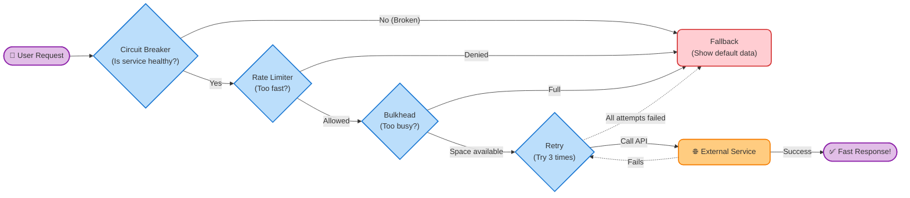

# 🛡️ PyFault-Tolerance: Bulletproof Python Microservices

Hello! Welcome to **PyFault-Tolerance**. 

If you've ever built microservices, you know that things inevitably go wrong. Networks drop, third-party APIs go down, and databases get overloaded. I built this library to give Python developers a simple, elegant toolkit to handle these failures gracefully.

Think of it as a safety net for your code—protecting your system from crashing entirely just because one small piece failed.

## ✨ What Does It Do?

It provides five essential stability patterns that you can wrap around your code easily:
1. **Circuit Breaker**: Stops sending traffic to a broken service until it recovers.
2. **Retry**: Automatically tries an operation again if it fails momentarily.
3. **Timeout**: Prevents your code from waiting forever on a slow response.
4. **Bulkhead**: Limits how many resources one specific task can consume.
5. **Rate Limiter**: Controls the speed of incoming traffic so you don't get overwhelmed.

## 📊 How They Work Together

Here is a simplified flowchart showing how these patterns protect a request before it reaches an external service:

## 🚀 Getting Started

It is fully async-native and built on top of modern Python `asyncio`. I've kept the codebase lightweight and highly readable, so you can easily understand what's happening under the hood.

Just install it and start wrapping your tricky network calls!
