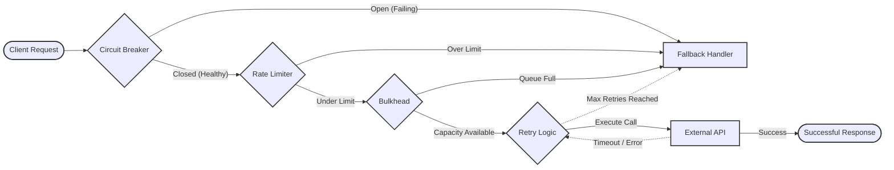

# PyFault-Tolerance: Resilient Python Microservices

Welcome to PyFault-Tolerance. 

In distributed microservice architectures, transient failures are inevitable. Network packets drop, downstream APIs experience latency spikes, and databases occasionally refuse connections. PyFault-Tolerance is an `asyncio`-native library designed to wrap your unreliable network calls in robust stability patterns, preventing localized failures from cascading and bringing down your entire system.

## The Resiliency Pipeline

PyFault-Tolerance implements five core resiliency patterns that can be composed together using simple Python decorators or async context managers.

## Technical Implementations

1. **Circuit Breaker**: Monitors the failure rate of outgoing requests. If the failure threshold is exceeded, the circuit trips to an "Open" state, failing fast and giving the downstream service time to recover. It periodically enters a "Half-Open" state to test if the service has stabilized before fully closing again.
2. **Retry Mechanism**: Automatically re-executes failed operations based on configurable backoff strategies (e.g., Exponential Backoff with Jitter). This handles transient network blips effectively.
3. **Timeout**: Enforces strict upper bounds on execution time using `asyncio.wait_for` semantics, preventing resource exhaustion caused by infinitely hanging sockets.
4. **Bulkhead (Concurrency Limiter)**: Implements asynchronous semaphores to restrict the maximum number of concurrent executions for a specific resource. This ensures that one slow endpoint doesn't consume the entire connection pool.
5. **Rate Limiter**: Utilizes a Token Bucket algorithm to throttle outbound requests, ensuring you stay within the rate limits imposed by third-party APIs.
6. **Fallback**: Provides graceful degradation by returning default responses or cached data when all primary execution attempts fail or are rejected by the protective layers above.

## Telemetry Integration

PyFault-Tolerance natively exports internal state changes and execution metrics (such as circuit breaker trips and retry counts) to standard observability backends including OpenTelemetry, Prometheus, and StatsD.
